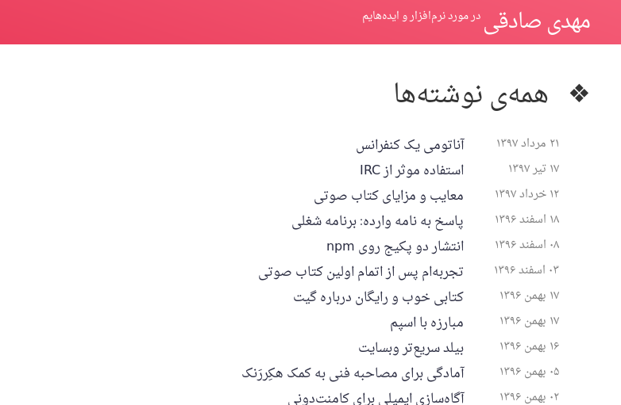

mehdix.ir
=========

This is the source code of my personal Persian [website](http://mehdix.ir). Persian aka Farsi is written right-to-left, however some people use Roman script to write Persian language in messaging applications and social networks.

This repository can be of use to anybody willing to build a new right to left website. I gradually fix issues which I came across while writing new posts in my website. This website is produced using [Jekyll](http://jekyllrb.com/) static site generator.

For any discussion regarding creating static websites with Jekyll please refer to the above mentioned Gitter channel.

# Helfpul Tips
- This website is based on [jekyll-theme-mehdix-rtl](https://github.com/mehdisadeghi/jekyll-theme-mehdix-rtl) theme.
- Currently (2019) is hosted on Netlify servers.
- Form submissions are handled by Netlify.
- `scripts/rebuild_comments.py` uses Netlify API and builds yaml collections for the static comments.
- **Hosting on GitHub Pages will fail** due to lack of necessary gems on their build servers.
- A lambda function is used to inform OP (original poster) about replies to their comments.

## Functions
Sources are inside `src/_functions` directory. To build functions install `netlify` cli and run:

    netlify functions:build

# Make it yours
Take the following steps to make your own website:

  1. Fork the repository
  2. Edit CNAME file and replace its content with your domain name
  3. [Add an A record](https://help.github.com/articles/tips-for-configuring-an-a-record-with-your-dns-provider/) with your DNS provider to point to Github nameservers (otherwise your website would be only reachable under
  *username.github.io* or *username.github.io/repository_name*).
  4. Edit _config.yml to reflect your information
  5. Move _posts/* contents to _drafts/* or delete them (you can use them as template)
  6. Edit _includes/footer.html and edit feedburner and validation links. Alternatively
  	you can delete any link that you don't like. To use feedburner you have to setup an
  	account there for your website.
  7. Write your awesome stories :heart:

  ## Important note
  In order to [build](http://mehdix.ir/jekyll-structure.html) the website correctly, you have to 
  name the forked repository different from your username. If you put it under a repository like *yourusername.github.io* Github will use its own Jekyll builder to build your website, no matter what you put inside *gh-pages* branch. Happy writing!
